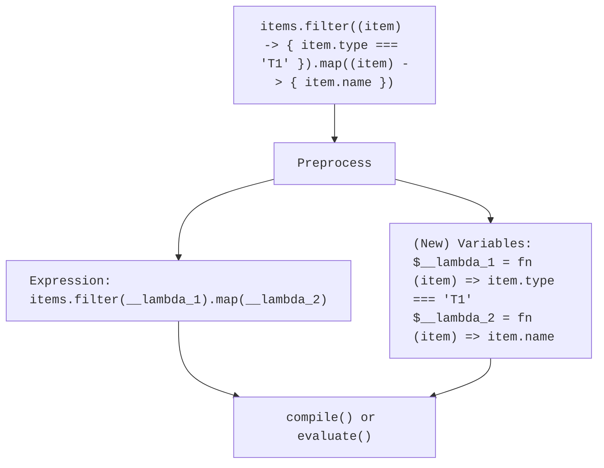

# 🔌 Symfony Expression Language Arrow Function

[](https://github.com/uuf6429/expression-language-arrowfunc/actions/workflows/ci.yml)
[](https://codecov.io/gh/uuf6429/expression-language-arrowfunc)
[](https://php.net/)
[](https://packagist.org/packages/uuf6429/expression-language-arrowfunc)
[](https://packagist.org/packages/uuf6429/expression-language-arrowfunc)
[](https://packagist.org/packages/uuf6429/expression-language-arrowfunc)

This library extends Symfony [Expression Language component] to support _Arrow Function_ (also known as _Lambda
Functions_) syntax.

## 🔌 Installation

Install via Composer:

```shell
composer require uuf6429/expression-language-arrowfunc
```

## 💡 Before You Start

<details>
<summary>1. How does it work?</summary>

Essentially, the library pre-processes expressions to replace callbacks with placeholders (variables), then generates
new variables (with the callback as value), which are finally later on used for executing the expression.
Conceptually:



</details>

<details>
<summary>2. What does the syntax look like?</summary>

By default, the arrow function syntax looks like so:

```text
 (a) -> { a * 2 }
  ▲  ▲      ▲
  │  │      └── Function body is a single expression that can make
  │  │          use of passed parameters or global variables.
  │  └───────── The lambda operator - input parameters are to the
  │             left and the output expression to the right.
  └──────────── Comma-separated list of parameters passed to the
                arrow function.
```

</details>

<details>
<summary>3. How safe is it?</summary>

Symfony Expression Language can be unsafe by design – if the result of expressions is used as a callable without being
checked, global callables, functions and static methods could be called arbitrarily from (potentially malicious)
expressions. This library acknowledges the risk and tries to mitigate it.

**Problem Examples**

1. Exposing functionality that accepts a callable to Expression Language:
   ```php no-test
   $el = new ExpressionLanguage();
   $el->addFunction(new ExpressionFunction(
       'array_map',
       static fn ($callback, $array) => sprintf('\array_map(%s, %s)', $callback, $array),
       static fn (array $variables, callable $callback, array $array) => array_map($callback, $array),
   ));
   
   // Intended expression
   $result = $el->evaluate('array_map([" aa "], "trim")');  // => ['aa']
   
   // Malicious expression
   $result = $el->evaluate('array_map([123], "exit")');     // 💥 application exits with code 123
   ```
2. A naive implementation of arrow functions:
   ```php no-test
   $el = new ExpressionLanguage();
   
   // Intended expression
   $filter = $el->evaluate('(value) -> { value > 20 }');
   $values = array_filter([18, 23, 40], $filter);           // => [23, 49]
   
   // Malicious expression
   $filter = $el->evaluate('"exit"');
   $values = array_filter([18, 23, 40], $filter);           // 💥 application exits with code 18
   ```

**Solutions**

There are two viable solutions:

1. Set the type declaration of methods or functions that will receive callbacks to `Closure` (*not `Callable`!*) - it
   works, but it is prone to mistakes and frankly, quite risky.
2. The engine wraps callbacks within an object that cannot be invoked by default – this is the safest option (and the
   default). Usages need to be aware of this wrapping, drastically decreasing the risk of mistakes.

</details>

## 🚀 Usage

## Usage

Two different APIs are provided to suit your integration needs:

<details>
<summary>1. Ready-Made Drop-in Replacement</summary>

If you just need a standard, drop-in replacement for Symfony's standard `ExpressionLanguage` class, use
[`uuf6429\ExpressionLanguage\ExpressionLanguage`]:

```php
use uuf6429\ExpressionLanguage\ExpressionLanguage;

$el = new ExpressionLanguage();

$phpCode = $el->compile('(val) -> { val * 2 }', []);
assert($phpCode === 'function ($val) { return ($val * 2); }');
```

</details>

<details>
<summary>2. Extensible Trait</summary>

If you want to integrate this functionality with your own custom `ExpressionLanguage` implementation or combine it with
other classes, use the trait [`uuf6429\ExpressionLanguage\ArrowFunctionTrait`]:

```php
use Symfony\Component\ExpressionLanguage\ExpressionLanguage as SymfonyExpressionLanguage;
use uuf6429\ExpressionLanguage\ArrowFunctionTrait;

class MyCustomExpressionLanguage extends SymfonyExpressionLanguage
{
    use ArrowFunctionTrait;

    public function evaluate($expression, $values = [])
    {
        return $this->evaluateWithArrowFunctions($expression, $values);
    }

    public function compile($expression, $names = [])
    {
        return $this->compileWithArrowFunctions($expression, $names);
    }

    protected function compileWithoutArrowFunctions($expression, array $names = []): string
    {
        // TODO Implement method
    }

    protected function evaluateWithoutArrowFunctions($expression, array $values = [])
    {
        // TODO Implement method
    }
}
```

</details>

> [!IMPORTANT]
>
> For safety reasons, callbacks are wrapped in a [`SafeCallable`] object. Your methods and functions need to expect
> and handle that object. This is to avoid expressions being able to "break out" and execute anything.

Here's a more complete example:

```php
use Symfony\Component\ExpressionLanguage\ExpressionFunction;
use uuf6429\ExpressionLanguage\ExpressionLanguage;
use uuf6429\ExpressionLanguage\SafeCallable;

$el = new ExpressionLanguage();

// Expose array_map() as map()
$el->addFunction(new ExpressionFunction(
   'map',
   static fn (string $callbackExpr, string $arrayExpr) => sprintf('\array_map(%s->getCallback(), %s)', $callbackExpr, $arrayExpr),
   static fn (array $variables, SafeCallable $callback, array $array) => array_map($callback->getCallback(), $array),
));

// Compiling
$phpCode = $el->compile('map((val) -> { val * 2 }, values)', ['values']);
assert($phpCode === '\array_map(function ($val) { return ($val * 2); }->getCallback(), $values)');

// Evaluating
$result = $el->evaluate('map((val) -> { val * 2 }, values)', ['values' => [1, 2, 3]]);
assert($result === [2, 4, 6]);
```

[Expression Language component]: https://symfony.com/doc/current/components/expression_language.html

[`SafeCallable`]:https://github.com/uuf6429/expression-language-arrowfunc/blob/main/src/SafeCallable.php

[`uuf6429\ExpressionLanguage\ExpressionLanguage`]: https://github.com/uuf6429/expression-language-arrowfunc/blob/main/src/ExpressionLanguage.php

[`uuf6429\ExpressionLanguage\ArrowFunctionTrait`]: https://github.com/uuf6429/expression-language-arrowfunc/blob/main/src/ArrowFunctionTrait.php
